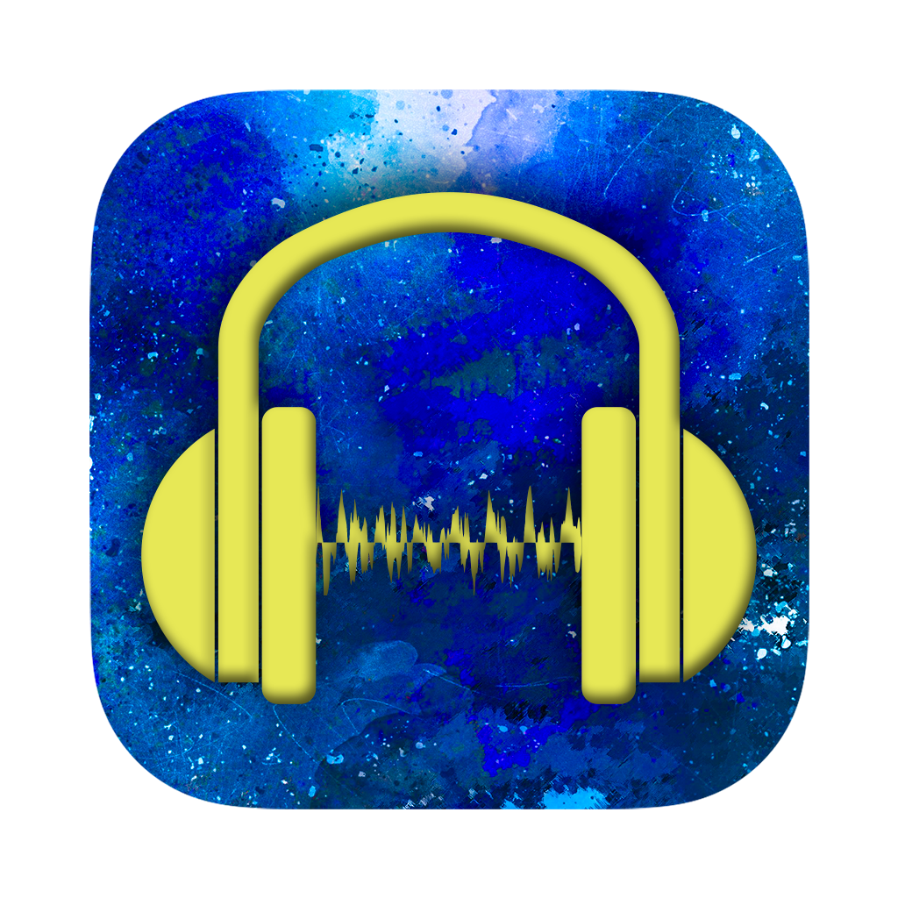
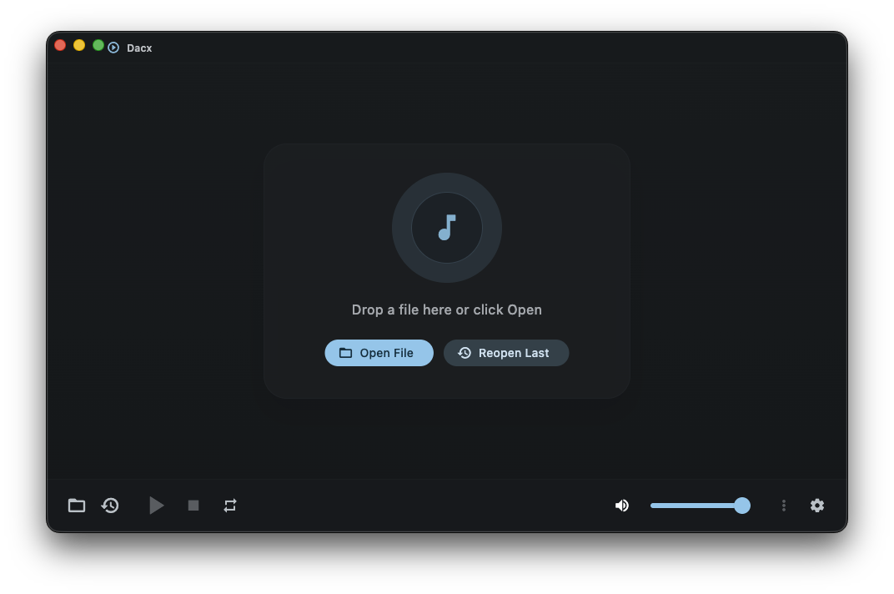

# Dacx: Cross-Platform Music and Video Player

Fast, lightweight, open source media player for Windows, macOS, and Linux.

Built with Flutter + [media_kit](https://github.com/media-kit/media-kit) (libmpv).

[](https://github.com/BurntToasters/Dacx/releases/latest)
[](https://github.com/BurntToasters/Dacx/releases)
[](https://github.com/BurntToasters/Dacx/actions/workflows/test.yml)
[](LICENSE)

Dacx is a desktop music and video player focused on speed and low overhead, with modern playback controls, media session integration, and broad format support.

<div align="center">
  <table>
    <tr>
      <td valign="middle" align="center" width="220">
        
      </td>
      <td valign="middle" align="center">
        <p align="center">
  
&nbsp;
</p>
      </td>
    </tr>
  </table>
</div>

<h1 align="center">⬇️ Download Dacx</h1>
<p align="center">Need assistance? Check out the <b><u><a href="./docs/INSTALL.md">Installation Documentation</a></u></b>!</p>
<div align="center">
  
|  Windows |  MacOS |  Linux |
| :--- | :--- | :--- |
| **MSI:** [x64](https://github.com/BurntToasters/Dacx/releases/latest/download/Dacx-Windows-x64.msi) | **DMG:** [Universal](https://github.com/BurntToasters/Dacx/releases/latest/download/Dacx-macOS.dmg) | **AppImage:** [x64](https://github.com/BurntToasters/Dacx/releases/latest/download/Dacx-Linux-x86_64.AppImage) |
| <!--**Portable ZIP:** [x64](https://github.com/BurntToasters/Dacx/releases/latest/download/Dacx-Windows-x64.zip)--> | **ZIP:** [Universal](https://github.com/BurntToasters/Dacx/releases/latest/download/Dacx-macOS.zip) | **DEB:** [x64](https://github.com/BurntToasters/Dacx/releases/latest/download/Dacx-Linux-amd64.deb) |
| | | **RPM:** [x64](https://github.com/BurntToasters/Dacx/releases/latest/download/Dacx-Linux-x86_64.rpm) |
| | | **Flatpak:** [x64](https://github.com/BurntToasters/Dacx/releases/latest/download/Dacx-Linux-x86_64.flatpak) |
| | | **TAR.GZ:** [x64](https://github.com/BurntToasters/Dacx/releases/latest/download/Dacx-Linux-x86_64.tar.gz) |

</div>

## Platforms

- Windows
- macOS
- Linux

## Features

- Audio + video playback for MP3, FLAC, WAV, OGG, AAC, Opus, MP4, MKV, AVI, WebM, and more (anything libmpv handles).
- 10-band equalizer with presets.
- Multi-audio-track mixing via `lavfi-complex` (experimental and currently unstable).
- Resume playback from where you left off.
- Compact mode and always-on-top window.
- System media-session integration: lock-screen / Now Playing / SMTC controls, artwork, and scrubbing.
- File associations + custom document icon on Windows and Linux.
- Built-in update checker against GitHub releases.
- Notarized & Signed DMG and ZIP for macOS; signed installers via GPG for Windows and Linux.

## Development

> [!NOTE]
> This project uses Flutter/Dart but also NodeJS. Its a little bit messy and not the best of practices I know, im just the most familiar and confident with js scripting and node so thats how the project is controlled. Sorry :P

```bash
# Install Node.js dependencies (build scripts)
npm install

# Install Flutter dependencies through FVM
fvm flutter pub get

# Run in development mode
npm run dev

# Run tests
npm run test:all

# Build for current platform
npm run build:win   # Windows
npm run build:mac   # macOS
npm run build:linux # Linux
```

### Signing model

Only the macOS build is code-signed end-to-end (Apple Developer ID + notarization). Windows MSIs and Linux DEB/RPM/TAR.GZ artifacts are signed with a **GPG detached signature** (the project's release key) — there is no Authenticode certificate for Windows.

This means:

- `scripts/flutter-build-macos.js` requires `APPLE_TEAM_ID` in `.env`. Self-update pins against the team id. Set `DACX_BUILD_DEV_NO_TEAM_ID=1` to skip for local dev:
  ```bash
  DACX_BUILD_DEV_NO_TEAM_ID=1 npm run build:mac
  ```
- `scripts/flutter-build-windows.js` accepts `WINDOWS_SIGNING_CERT_THUMBPRINT` (or `DACX_WINDOWS_SIGNER_THUMBPRINT`) *optionally* for local dev. If unset, the MSI is unsigned at the OS level and self-update relies on the Ed25519-signed update manifest. On **release VMs**, set the thumbprint in `.env` and add `DACX_REQUIRE_WINDOWS_SIGNER=1` so `npm run build:win` fails when the thumbprint is missing (see `SECURITY.md`).
- `scripts/flutter-build-linux` is not affected by either.

### macOS support

The macOS build targets **macOS 15 (Sequoia) or newer**. Older macOS versions are not supported.

## License

[GPLv3](LICENSE)
